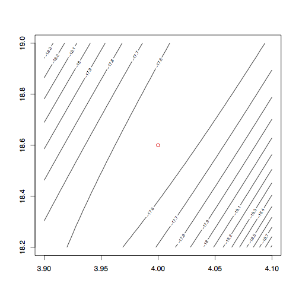
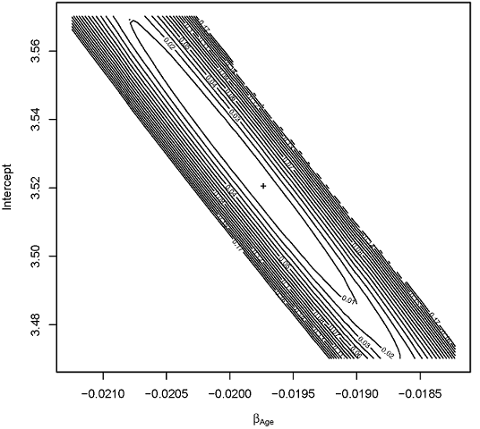

KMC
===
This is the R package 'kmc'(Kaplan Meier estimator with Constraints) written and maintained by Yifan Yang (<mailto:yifan.yang@uky.edu>), and co-authored by Dr Zhou (<http://www.ms.uky.edu/~mai/>). The package is released on CRAN (http://cran.r-project.org/web/packages/kmc/). 

Installation
============
One can install the development version uisng

```{r}
library(devtools); 
install_github('kmc', 'yfyang86');
```

Examples
=========

One/two constraints
------------

Run the following code in R with only one null hypothesis E[X]=\int x d F(x) = 3.7. :

```{r}
library(kmc)
x <- c(1, 1.5, 2, 3, 4.2, 5, 6.1, 5.3, 4.5, 0.9, 2.1, 4.3)
d <- c(1, 1, 0, 1, 0, 1, 1, 1, 1, 0, 0, 1)
f <- function(x) {
    x - 3.7
}
g = list(f = f)
result = kmc.solve(x, d, g)
print(result)
---------------------------------------------------------------------------------
A Recursive Formula for the Kaplan-Meier Estimator with Constraint
Information:
Number of Constraints:	 1
lamda(s):	 -1.439612

---------------------------------------------------------------------------------
     Log-likelihood(Ha)  Log-likelihood(H0)  -2LLR     p-Value(df=1)
Est  -17.5198            -17.8273              0.6150    0.4329
---------------------------------------------------------------------------------

```

If we add another constraint: E[X^2]=16.5, then 

```{r}
> myfun5 <- function(x) {
+     x^2 - 16.5
+ }
> # construnct g as a LIST!
>
> g = list(f1 = f, f2 = myfun5)
> re0 <- kmc.solve(x, d, g)
> re0

---------------------------------------------------------------------------------
A Recursive Formula for the Kaplan-Meier Estimator with Constraint
Information:
Number of Constraints:	 2
lamda(s):	 -0.4148702 -0.1546575

---------------------------------------------------------------------------------
     Log-likelihood(Ha)  Log-likelihood(H0)  -2LLR     p-Value(df=2)
Est  -17.5198            -17.8345              0.6293    0.7301
---------------------------------------------------------------------------------
```


Contour Plot
--------------
If there were two constraints, we could plot a contour plot for the log-likelihood. Typically, 30 X 30 data points, are used to draw the contour plot, which means the computation repeats 900 times.

```{r}
ZZ <- plotkmc2D(re0)
```

This package offers a naive contour plot. One can use `ZZ` to draw contour plot with the help of `ggplot2`.


A careful tuning version is 

```{r}
#!/usr/local/bin/Rscripta
# file: TESTKMC.R
args <- commandArgs(TRUE)

t1=as.numeric(args[1])
t2=as.numeric(args[2])

library(kmc)
x <- c(1, 1.5, 2, 3, 4.2, 5, 6.1, 5.3, 4.5, 0.9, 2.1, 4.3)
d <- c(1, 1, 0, 1, 0, 1, 1, 1, 1, 0, 0, 1)
f_1 <- function(x) {x - t1}

f_2 <- function(x) {x^2-t2}
g <- list(f1=f_1,f2=f_2);

re0 <- kmc.solve(x, d, g)

ZZ <-  plotkmc2D(re0,range0 = c(0.1, .4, 30))
```




This version uses a 30*30 grid to contruct the contour plot on a iMac2007 2.0Hz Core2 machine and only spend (2s to load R): 

```sh
time Rscript TESTKMC.R 4.0 18.6
real0m20.202s
user0m18.817s
sys0m0.240s
```
Real Data Example
--------------------------
`stanford5`: stanford heart transplant data contains 152 observations. We could draw a contour plot of intercept and slope.

```r
LL= 50
beta0 <- 3.52016
beta1 <- -0.01973458 #-0.0185
beta.grid <- function(x0,range,n0,type="sq",u=5){
	n0 = as.double(n0)
	if (type=="sq"){
		o1 <- c(
		-range*(u*(n0:1)^2)/(u*n0^2),0,
		range*(u*(1:n0)^2)/(u*n0^2)
		)
	}else{
	if (type=='sqrt'){
		o1 <- c(
		-range*(u*sqrt(n0:1))/(u*sqrt(n0)),0,
		range*(u*sqrt(1:n0))/(u*sqrt(n0)))
		}else{
		o1=c(
		-range*(n0:1)/n0,
		0,
		range*(1:n0)/n0
		)
		}  
	}
	return(
		x0+o1
		);
}

beta.0 <- beta.grid(beta0,0.05,LL,"l")
beta.1 <- beta.grid(beta1,.00151,LL,"l")#0.00051

set.seed(1234)
y=log10(stanford5$time)+runif(152)/1000

d <- stanford5$status

oy = order(y,-d)
d=d[oy]
y=y[oy]
x=cbind(1,stanford5$age)[oy,]

ZZ=matrix(0,2*LL+1,2*LL+1)

library(kmc)
tic=0
for(jj in 1:(2*LL+1)){
for(ii in 1:(2*LL+1)){
  beta=c(beta.0[ii],beta.1[jj])
  ZZ[jj,ii]=kmc.bjtest(y,d,x=x,beta=beta,init.st="naive")$"-2LLR"
}
}
ZZ2<-ZZ
ZZ[ZZ<0]=NA ## when KMC.BJTEST fails to converge, it'll return a negative value.

range(ZZ,finite=T) -> zlim
floor.d<-function(x,n=4){floor(x*10^n)/(10^n)}

postscript("C:/Temp/Fig2_1.eps",width=7,height=7)
contour(
  y=beta.0,
  x=beta.1,
  ZZ,
  zlim=c(0,.17),
  levels=unique(floor.d(
		beta.grid(x0=mean(zlim),range=diff(zlim)/2,n0=15,type="sqrt",u=10),
		4)),
  ylab="Intercept",
  xlab=expression(beta[Age])
  ) 
```

The countour plot is 



Initial value
-------------
There are known issues on some scenario when dealing with more than one constraint. According to our simulation, automatic tuning strategy fails under some constraints. One can always use proper initial values, and I will add additional strategies in future work.

In current developing version, this package depends on `rootSolve::multiroot`, which provides a lot of options. After rootSolve was updated, `kmc` doesn't work on option: `em.boost=T` or `using.C=T`. The safe option to calculate the model is 

```
kmc.solve( x,d,g,em.boost=F,using.num=T,using.Fortran=T,using.C=F,em.it=10)
```

This issue is related to initial value selection problem. The next version may remove the dependency on `rootSolve` and introduce a C++ port for `emplik::el.cen.EM`.

Bug Report
--------------

Please contact Yifan Yang (<mailto:yifan.yang@uky.edu>), or leave feed back on the github page.
