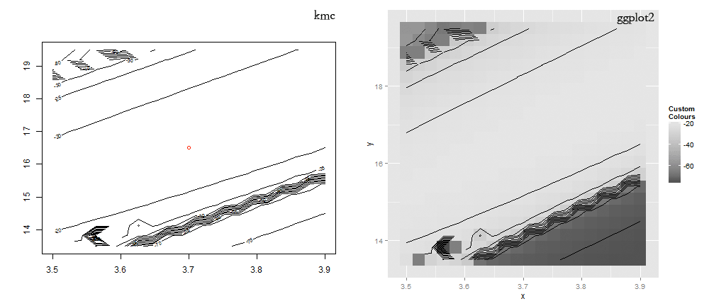

KMC
===
This is the R package 'kmc'(Kaplan Meier estimator with Constraints) written and maintained by Yifan Yang (<mailto:yifan.yang@uky.edu>), and co-authored by Dr Zhou (<http://www.ms.uky.edu/~mai/>). The package is released on CRAN (http://cran.r-project.org/web/packages/kmc/). 

Installation
============
One can install the development version uisng

```{r}
library(devtools); 
install_github('kmc', 'yfyang86');
```

Examples
=========

One/two constraints
------------

Run the fllowing code in R:

```{r}
library(kmc)
x <- c(1, 1.5, 2, 3, 4.2, 5, 6.1, 5.3, 4.5, 0.9, 2.1, 4.3)
d <- c(1, 1, 0, 1, 0, 1, 1, 1, 1, 0, 0, 1)
f <- function(x) {
    x - 3.7
}
g = list(f = f)
result = kmc.solve(x, d, g)
print(result)
```

The Null hypothesis is E[X]=\int x d F(x) = 3.7. 

<blockquote>
---------------------------------------------------------------------------------
A Recursive Formula for the Kaplan-Meier Estimator with Constraint
Information:
Number of Constraints:	 1
lamda(s):	 -1.439612

---------------------------------------------------------------------------------
     Log-likelihood(Ha)  Log-likelihood(H0)  -2LLR     p-Value(df=1)
Est  -17.5198            -17.8273              0.6150    0.4329
---------------------------------------------------------------------------------
</blockquote>


If we add another constraints: E[X^2]=16.5, then 

```{r}
> myfun5 <- function(x) {
+     x^2 - 16.5
+ }
> # construnct g as a LIST!
>
> g = list(f1 = f, f2 = myfun5)
> re0 <- kmc.solve(x, d, g)
> re0

---------------------------------------------------------------------------------
A Recursive Formula for the Kaplan-Meier Estimator with Constraint
Information:
Number of Constraints:	 2
lamda(s):	 -0.4148702 -0.1546575

---------------------------------------------------------------------------------
     Log-likelihood(Ha)  Log-likelihood(H0)  -2LLR     p-Value(df=2)
Est  -17.5198            -17.8345              0.6293    0.7301
---------------------------------------------------------------------------------
```


Contour Plot
--------------
If there were two constraints, we could plot a contour plot for the log-likelihood. Typically, 30 X 30 data points, are used to draw the contour plot, which means the computation repeats 900 times.

```{r}
ZZ <- plotkmc2D(re0)
```

This package offers a naive contour plot. One can use `ZZ` to draw contour plot with the help of `ggplot2`.


Initial value
-------------
There are known issues on some scenario when dealing with more than one constraint. According to our simulation, automatic tuning strategy fails under some constraints. One can always use proper initial values, and I will add additional strategies in future work.





Bug Report
--------------

Please contact Yifan Yang (<mailto:yifan.yang@uky.edu>), or leave feed back on the github page.
